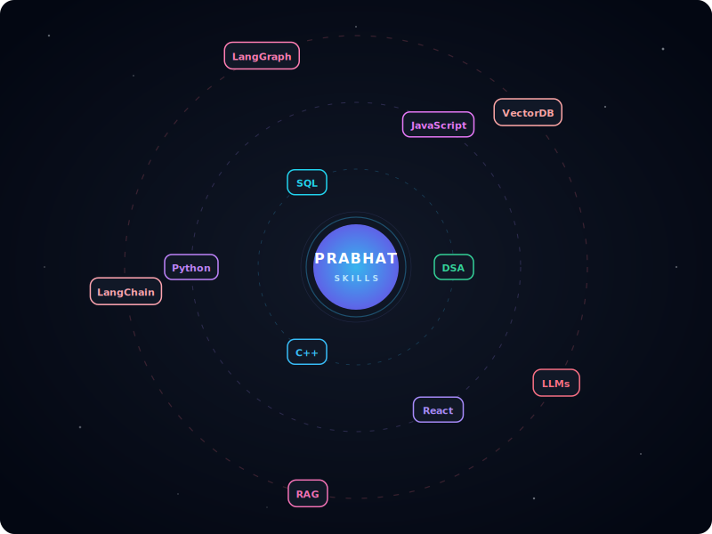

  

<h1 align="center">Hi 👋, I'm Prabhat Kumar Shah</h1>

  

 

<table border="0" width="100%">
  <tr>
    <td width="60%" valign="top">
      <h3>💫 About Me</h3>
      
I am a passionate <b>Full Stack Web & Generative AI Developer</b> dedicated to building intelligent solutions, automated agentic pipelines, and interactive user interfaces.

      <ul>
        <li>🔭 <b>Currently Working On:</b> Advanced GenAI solutions including RAG pipelines, LLMs, LangChain, and LangGraph.</li>
        <li>🌱 <b>Data Intelligence:</b> Learning and building analytics structures with NumPy, Pandas, Seaborn, and Matplotlib.</li>
        <li>🎓 <b>Problem Solving:</b> Daily practice of Data Structures & Algorithms (DSA) to write clean, optimized, and performant code.</li>
        <li>⚡ <b>Aspirations:</b> Constantly acquiring new skills and bringing high-fidelity, innovative ideas to life.</li>
      </ul>
    </td>
    <td width="40%" valign="top" align="center">
      
    </td>
  </tr>
</table>

---

### 🌌 Interactive Skill Orbit Map

  

---

### 🛠️ Tech Stack & Toolkit

<b>🧠 Generative AI & Large Language Models</b>

 

  
  
  
  
  

<b>💻 Languages & Core CS</b>

 

  
  
  
  
  

<b>🌐 Frontend & Data Libraries</b>

 

  
  
  
  
  

---

### 🏆 Featured Projects

<table width="100%" border="0" cellpadding="10" cellspacing="0">
  <tr>
    <!-- Project 1: Pipeline Builder -->
    <td width="50%" valign="top" style="border: 1px solid #30363d; border-radius: 8px; padding: 15px;">
      

        <h3>⌁ Visual Pipeline Builder</h3>
        
A professional node-based workflow editor built on React Flow and FastAPI with dynamic handle rendering and DFS validation.

        

          
          
          
        

        <a href="https://github.com/Prabhat12112002/Pipeline-Builder" target="_blank"><b>Repository →</b></a>
      

    </td>
    <!-- Project 2: Lease Assistant -->
    <td width="50%" valign="top" style="border: 1px solid #30363d; border-radius: 8px; padding: 15px;">
      

        <h3>📄 Lease Assistant AI</h3>
        
An intelligent RAG assistant built to parse complex lease agreements, automatically extract key clauses, and answer queries.

        

          
          
          
        

      

    </td>
  </tr>
  <tr>
    <!-- Project 3: Email Automation -->
    <td width="50%" valign="top" style="border: 1px solid #30363d; border-radius: 8px; padding: 15px;">
      

        <h3>✉️ Agentic Email Automation</h3>
        
A smart multi-agent workflow that listens to incoming emails, categorizes content intent, and drafts context-aware replies.

        

          
          
          
        

      

    </td>
    <!-- Project 4: Pathological Image Classification -->
    <td width="50%" valign="top" style="border: 1px solid #30363d; border-radius: 8px; padding: 15px;">
      

        <h3>🔬 Pathological Image Classification</h3>
        
A deep learning computer vision model designed to classify high-resolution pathology scans and assist in anomaly detection.

        

          
          
          
        

      

    </td>
  </tr>
</table>

---

### 📊 GitHub Stats & Metrics

  
  

---

### 🌐 Connect & Collaborate

  
  
  

